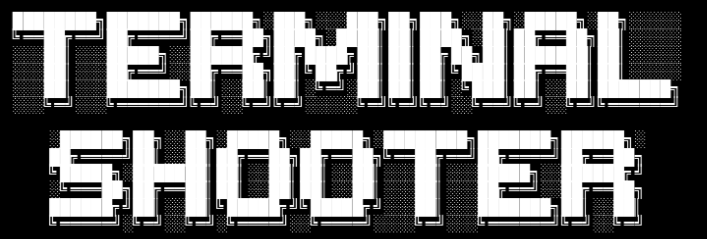

# Terminal Shooter
Projeto de Algoritmos e Estruturas de Dados I - Inspirado em Wolfenstein 3D, DOOM e QUAKE.

  

make: `mingw32-make`

## Integrantes:
- Augusto Luchesi Matos
- Daniel Lombardi de Oliveira
- Pedro Freire Baleeiro

### Pseudo-Relatorio:
O primeiro passo foi a adaptação do renderizador ao sistema utilizado. O renderizador funciona utilizando caracteres [ASCII](http://www.asciitable.com) sem colorização. A renderização (por ray-tracing/casting) cria uma ilusão 3D a partir das ditâncias dos objetos e entidades do mapa. A HUD e o mini-mapa são tratados como overlays e são adicionados sobre o frame após sua renderização a partir de uma `std::string` que é interpretada para maior flexibilidade artística dos caracteres.

Dentro do funcionamento do renderizador, houve a necessidade do uso de TADs do tipo listas cadastrais para armazenamento, passagem e busca de informações específicas como encontradas na implementação das classes [map](src/map.cpp), [engine](src/engine.cpp) e [player](src/player.cpp).

A próxima etapa foi adaptar os elementos previstos ([Entidades](src/headers/entity.h), utilizadas pelas classes: [Player](src/headers/player.h) e [Mob](src/headers/mob.h)). Neste momento, foi criado a fila (TAD) de spawn de mobs, que trabalha com a classe [MobsWave](src/headers/mob.h) para preencher o tabuleiro de inimigos ao final dos rounds.

Em seguida (16/6) o loop do jogo foi tratado. Utilizamos a standard library `chrono` para marcar a diferença entre cada iteração do loop principal (encontrado na [main.cpp](src/main.cpp)), agora garantimos que a movimentacao das Entidades ocorre de maneira constante, independente da frequência de atualização do jogo (que depende do computador do usuário, desde que rode pelo menos a tick rate definida na [engine.h](src/engine.h)). Agora é possível tratar dos eventos dentro do loop (dano, movimentação etc).

Com as adaptações em relação ao tempo e criação da tick-rate do jogo, foi possível (finalmente) implementar os disparos e danos aos mobs (feitos por hit-scan), com lógica muito próxima ao do ray-tracing utilizado na renderização.

Conforme a complexidade do código ia aumentando cada vez mais, adicionar uma simples funcionalidade como permitir que o jogador recarregasse sua arma necessitava de diversas modificações e adições ao código de varios arquivos, causando grande probabilidade de erros. Assim, foi desenvolvida uma simples classe de Logging (encontrada em [`utils.h`](src/headers/utils.h)) que possibilitou o desenvolivmento mais consciso e robusto de novas features, já que agora poderiamos conferir valores das variáveis sem precisar ter a feature completa em funcionamento. Estes "mini-projetos" dentro do trabalho principal foram ótimas maneiras de aumentar nosso conhecimento em C++, no caso do Logger, o principal foi o trabalho com [Veriadic Templates](https://en.cppreference.com/w/cpp/language/parameter_pack) (template pack), permitindo passar diferentes quantidades de parâmetros para uma função (o equivalente ao `*args, **kwargs`, em python).

Foi desenvolvido um melhor meio de lidar com geração aleatória de elementos no jogo (RNG), por meio da utilização de bibliotecas de tempo em microsegundos e da utilização de matemática modular para calcular números entre certos intervalos desejados (como por exemplo, as vidas dos mobs de acordo com quantidade de inimigos e número de inimigos por round). Com isso, foi possível também implementar uma geração infinita de novos mobs nos locais adequados do mapa.

Chegando às últimas adições de funcionalidade importantes, conseguimos criar um mecanismo de dano que o inimigo causa ao player quando próximo um do outro, essa feature também usa do RNG mencionado anterior para balancear a dificuldade do jogo, de tal modo que o dano de cada inimigo é inversamente proporcional a quantidade de inimigos por round. Também foi adicionado um score básico com base no número de rounds ganhos.

A movimentação dos inimigos não foi possível de ser implementada pela falta de tempo, mesmo após seguidas tentativas. Não foi viável manter a forma inicial que tentamos, pois diversos bugs surgiram e estava atrapalhando o funcionamento do restante do jogo.

Foi criada uma tela de morte quando o usuário tem sua vida zerada. Foi utilizada uma arte em ASCII para representar números grandes e letras grandes com a escrita "YOU DIED" na parte superior do terminal e o score final do player na parte inferior. Foi utilizado um switch case para checar o valor de cada dígito inteiro obtido do score e a partir desta informação, desenhar o respectivo valor em ASCII.

### POSSIVEIS ADIÇÕES:

- Implementar Entidades com movimentacao, TAD das entidades.
- Municao com TAD (fila) e tipos diferentes

### NAO-URGENTE:
- Tipos de entidades (95% feito)

### Prioridades:

- Possível movimentacao

- Possível tela de início (press any button)

lines:
`cpp`: 1087
`h`: 444
`git ls-files | grep EXTENSION | xargs wc -l`
